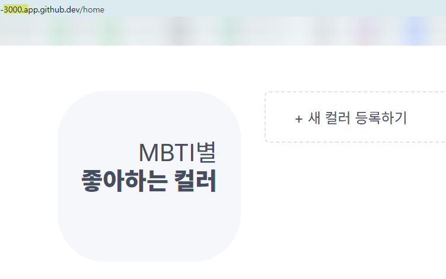

# Ⅰ. 세팅 배경 지식

[Docker Cheat sheet](https://www.canva.com/design/DAGRvX_W5Ug/GmD2peFIJEpvc9mmwo-f8A/view?utm_content=DAGRvX_W5Ug&utm_campaign=designshare&utm_medium=link&utm_source=editor)

## cf. Question 정리

① Hypervisor와 Container 기술의 차이점?
 
> → **Hypervisor**: 하나의 하드웨어 위에 여러 OS 격리실행 </br>
> - **단위**: VM(Virtual Machine)
 
> → **Container**: 하나의 OS 위에 여러 App 격리실행 </br>
> - **단위**: Container
> - **Container build할 내용저장**: Image </br>
>   - **Image**작성방법: 의미있는 단위(layer)들을 조합하여 생성. 변경내용 존재시, 변경이 발생한 layer만 수정하여 조합 </br>
>   - **Image**버전관리방법: Digest (Image version을 지칭, SHA 해시값) </br>
>       - **Digest**관리방법: 중요한 Digest(해시값)에는 tag를 붙여 별칭함 </br>
>       - **tag사용예시**: 가장 최근의 Digest에는 자동으로 "latest" tag가 붙음


</br>

② 일반 Process와 Container의 차이점?

> → **Process**: 메모리 수준에서 격리 </br>

> → **Container**: 네트워크, 파일시스템, 메모리 수준에서 격리 </br>
(기본 Process보다 더 강하게 격리된 Process)

</br>

## 1. Image 관리

### ① 기초정보

[docker image syntax](https://docs.docker.com/reference/cli/docker/image/) </br>
[docker hub](https://hub.docker.com/) # 이미 만들어진 image들 정보 검색

### ② Image pull

```bash
# docker image pull [OPTIONS] NAME[:TAG|@DIGEST]
$ docker image pull node:20.15.1 # tag 이용해서 pull
$ docker image pull node@sha256:b21bcf3e7b6e68d723eabedc6067974950941167b5d7a9e414bd5ac2011cd1c4 # digest 이용해서 pull
$ docker image pull node # 그냥 pull (latest tag가 pull 됨)
```

### ③ Image list

```bash
# docker image ls [OPTIONS] [REPOSITORY[:TAG]]
$ docker image ls
REPOSITORY   TAG       IMAGE ID       CREATED         SIZE
node         latest    ac646c3c87d5   4 days ago      1.13GB
node         <none>    1d063816b8cc   10 months ago   199MB
node         20.15.1   fe6f5eb26002   10 months ago   1.1GB

# diegest를 이용하여 pull하는 경우 tag가 없음(dangling images)
```

### ④ Image remove

```bash
# docker image rm [OPTIONS] IMAGE [IMAGE...]
$ docker image rm node:20.15.1
$ docker image ls
REPOSITORY   TAG       IMAGE ID       CREATED         SIZE
node         latest    ac646c3c87d5   4 days ago      1.13GB
node         <none>    1d063816b8cc   10 months ago   199MB
```

```bash
# docker image prune [OPTIONS]
$ docker image prune -a -f # -a 옵션없으면 모든 dangling images만 삭제함 # -f 옵션 없으면 진짜 삭제할 것인지 한번 더 물어봄
$ docker image ls
REPOSITORY   TAG       IMAGE ID   CREATED   SIZE
```

# Ⅱ. Image Build

## 1. Docker없이 프로덕트 환경 수작업으로 구축해보기기
### ① 의존성 모듈 설치
```bash
# 소스코드 최상위 위치로 이동하여 실행
$ npm ci
```

> "Continuous Integration (CI)" 환경에 최적화된 설치 방식으로서, "package-lock.json"을 기반으로 빠르고 정확하게 패키지를 설치 → "node_module" directory 에 모두 저장됨
> | 항목        | 설명                                        |
> | --------- | ----------------------------------------- |
> | **속도**    | `npm install`보다 **더 빠름**                  |
> | **재현성**   | `package-lock.json`에 **정확히 명시된 버전**으로만 설치 |
> | **설치방법**    | 기존 `node_modules` 폴더를 **완전히 삭제하고 새로 설치**  |

### ② npm run 동작방식 이해

> npm run → "package.json" 파일의 "scripts" 에 정의된 Alias를 실행
> ```json
> // package.json에 정의된 alias
> "scripts": {
>   "dev": "next dev",
>   "build": "next build",
>   "start": "next start",
>   "lint": "next lint"
> }
> ```
> | Alias           | 실제 실행 명령     | 역할 요약                      |
> | --------------- | ------------ | -------------------------- |
> | `npm run dev`   | `next dev`   | 개발 서버 실행 (핫 리로딩 지원)        |
> | `npm run build` | `next build` | 프로덕션용 정적/동적 페이지 빌드         |
> | `npm run start` | `next start` | 빌드 결과를 사용한 프로덕션 서버 실행      |
> | `npm run lint`  | `next lint`  | 코드 스타일 및 문법 검사 (ESLint 사용) |

### ③ npm run build
```bash
$ npm run build  # next build → ".next/" 디렉토리에 빌드 아티팩트 생성함
```

### ④ npm run start
```bash
$ npm run start # next start → next build로 만든 빌드 결과물을 기반으로 서버 실행
> mbti-nextjs@0.1.0 start
> next start

  ▲ Next.js 14.2.3
  - Local:        http://localhost:3000

 ✓ Starting...
 ✓ Ready in 287ms
```
> **localhost:3000 접속시** </br>
> 

## 2. 1번에서 수행한 작업 Dockerfile에 작성하고 Build 해보기 → 산출물: Image

[Dockerfile reference](https://docs.docker.com/reference/dockerfile/)

### ① 전체구조


### ② Dockerfile 작성

최상위폴더/Dockerfile

```Dockerfile
# node를 설치한다.
# FROM 베이스 이미지
ARG NODE_VERSION
FROM node:${NODE_VERSION}

# 소스코드를 다운로드한다.
# COPY [복사할 경로(호스트의 상대경로)] [붙여넣기할 경로(이미지내부의 절대경로)]
COPY . /app

# 소스코드의 최상위 디렉토리로 이동한다.
WORKDIR /app

# 소스코드를 실행할 때 필요한 파일을 다운로드한다. (npm ci)
# 소스코드를 빌드한다 (npm run build)
RUN npm ci \
&& npm run build

# 환경 변수를 정의한다. (PORT)
ENV PORT=3000

# 서버를 실행한다 (npm run start)
ENTRYPOINT ["npm", "run", "start"]
```

### ③ docker buildx build 명령어로 빌드 → 산출물: Image

[docker buildx build syntax](https://docs.docker.com/reference/cli/docker/buildx/build/) </br>

> cf. "docker image build"는 depreciate

```bash
# docker buildx build [OPTIONS] PATH | URL | -
$ docker buildx build \
> -t samon3869/mbti:embedded-db \
> -t samon3869/mbti \
> --build-arg NODE_VERSION=20.15.1 \
> -f ./Dockerfile \
> --pull \
> .
> 
```

```bash
$ docker image ls
REPOSITORY       TAG           IMAGE ID       CREATED         SIZE
samon3869/mbti   embedded-db   069a7d479696   2 minutes ago   1.9GB
samon3869/mbti   latest        069a7d479696   2 minutes ago   1.9GB
```

## 3. docker hub에 Image 배포하기

```bash
$ docker image push samon3869/mbti:embedded-db # embedded-db 배포
$ docker image push samon3869/mbti:latest #latest 배포
$ docker image push -a samon3869/mbti # 모두 배포
```