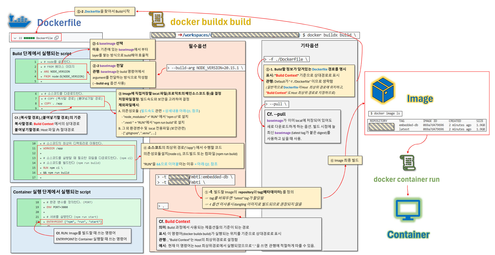
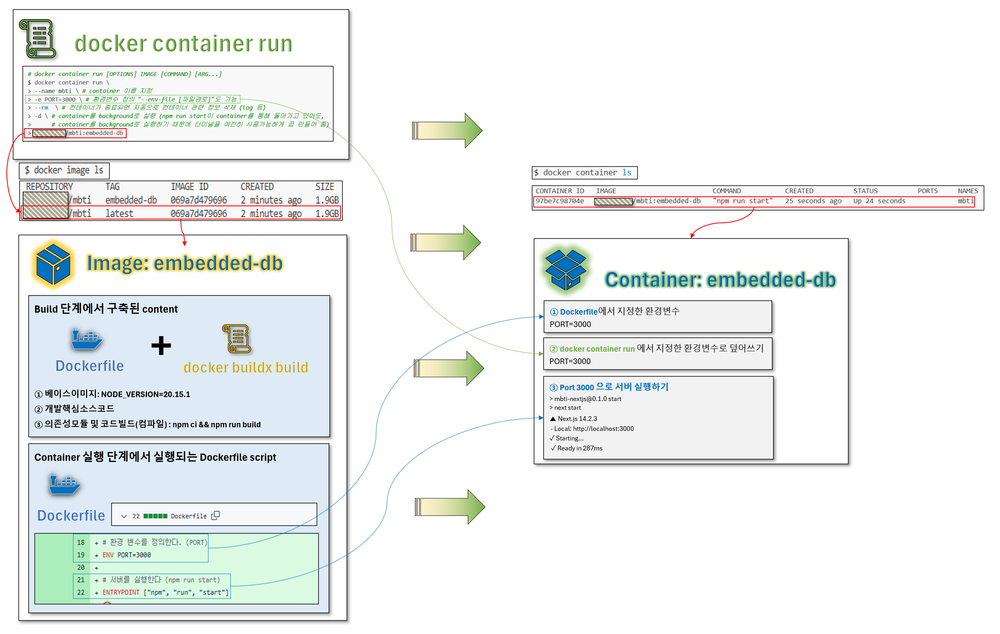
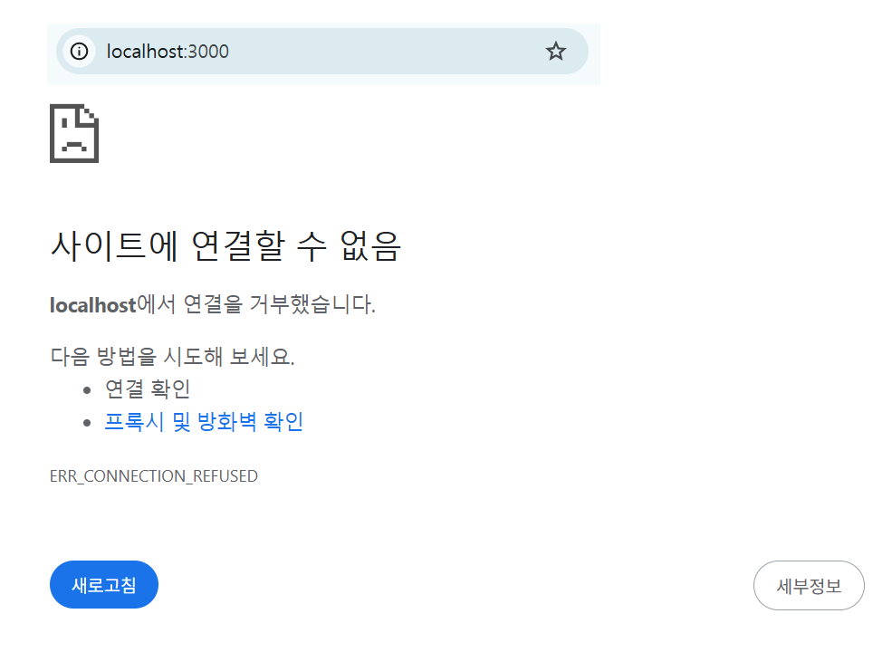
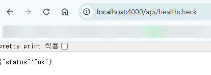
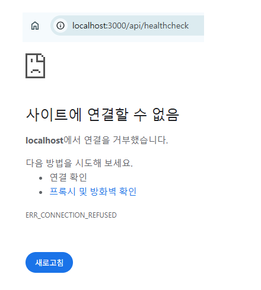
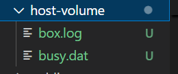

# Ⅰ. Container 기술 필요성 느끼기

[Docker Cheat sheet](https://www.canva.com/design/DAGRvX_W5Ug/GmD2peFIJEpvc9mmwo-f8A/view?utm_content=DAGRvX_W5Ug&utm_campaign=designshare&utm_medium=link&utm_source=editor)

## 1. Container 기술 개념

① Hypervisor와 Container 기술의 차이점?
 
> → **Hypervisor**: 하나의 하드웨어 위에 여러 OS 격리실행 </br>
> - **단위**: VM(Virtual Machine)
 
> → **Container**: 하나의 OS 위에 여러 App 격리실행 </br>
> - **단위**: Container
> - **Container build할 내용저장**: Image </br>
>   - **Image**작성방법: 의미있는 단위(layer)들을 조합하여 생성. 변경내용 존재시, 변경이 발생한 layer만 수정하여 조합 </br>
>   - **Image**버전관리방법: Digest (Image version을 지칭, SHA 해시값) </br>
>       - **Digest**관리방법: 중요한 Digest(해시값)에는 tag를 붙여 별칭함 </br>
>       - **tag사용예시**: 가장 최근의 Digest에는 자동으로 "latest" tag가 붙음


</br>

② 일반 Process와 Container의 차이점?

> → **Process**: 메모리 수준에서 격리 </br>

> → **Container**: 네트워크, 파일시스템, 메모리 수준에서 격리 </br>
(기본 Process보다 더 강하게 격리된 Process)

</br>

③ 개념 이해를 돕는 기초 문법

> **cf. 기초정보**
>
> [docker image syntax](https://docs.docker.com/reference/cli/docker/image/) </br>
> [docker hub](https://hub.docker.com/) # 이미 만들어진 image들 정보 검색

> **A. Image pull**
> ```bash
> # docker image pull [OPTIONS] NAME[:TAG|@DIGEST]
> $ docker image pull node:20.15.1 # tag 이용해서 pull
> $ docker image pull node@sha256:b21bcf3e7b6e68d723eabedc6067974950941167b5d7a9e414bd5ac2011cd1c4 # digest 이용해서 pull
> $ docker image pull node # 그냥 pull (latest tag가 pull 됨)
> ```

> **B. Image list**
> ```bash
> # docker image ls [OPTIONS] [REPOSITORY[:TAG]]
> $ docker image ls
> REPOSITORY   TAG       IMAGE ID       CREATED         SIZE
> node         latest    ac646c3c87d5   4 days ago      1.13GB
> node         <none>    1d063816b8cc   10 months ago   199MB
> node         20.15.1   fe6f5eb26002   10 months ago   1.1GB
> 
> # diegest를 이용하여 pull하는 경우 tag가 없음(dangling images)
> ```

> **C. Image remove**
> ```bash
> # docker image rm [OPTIONS] IMAGE [IMAGE...]
> $ docker image rm node:20.15.1
> $ docker image ls
> REPOSITORY   TAG       IMAGE ID       CREATED         SIZE
> node         latest    ac646c3c87d5   4 days ago      1.13GB
> node         <none>    1d063816b8cc   10 months ago   199MB
> ```
>
> ```bash
> # docker image prune [OPTIONS]
> $ docker image prune -a -f # -a 옵션없으면 모든 dangling images만 삭제함 # -f 옵션 없으면 진짜 삭제할 것인지 한번 더 물어봄
> $ docker image ls
> REPOSITORY   TAG       IMAGE ID   CREATED   SIZE
> ```

## 2. Container 없이 next.js 프로덕트 환경을 수작업으로 구축해보기
### ① 의존성 모듈 설치
```bash
# 소스코드 최상위 위치로 이동하여 실행
$ npm ci
```

> "Continuous Integration (CI)" 환경에 최적화된 설치 방식으로서, "package-lock.json"을 기반으로 빠르고 정확하게 패키지를 설치 → "node_module" directory 에 모두 저장됨
> | 항목        | 설명                                        |
> | --------- | ----------------------------------------- |
> | **속도**    | `npm install`보다 **더 빠름**                  |
> | **재현성**   | `package-lock.json`에 **정확히 명시된 버전**으로만 설치 |
> | **설치방법**    | 기존 `node_modules` 폴더를 **완전히 삭제하고 새로 설치**  |


### ② npm run build
```bash
$ npm run build  # npm run next build → ".next/" 디렉토리에 빌드 아티팩트 생성함
```

> <strong>📌 npm run 동작방식 이해 </strong> </br>
> "package.json" 파일의 "scripts" 에 정의된 Alias 쌍을 이용해서 명령어 실행 </br>
> > **※ package.json 파일내용**
> > ```json
> > "scripts": {
> >   "dev": "next dev",
> >   "build": "next build",
> >   "start": "next start",
> >   "lint": "next lint"
> > }
> > ```
>
> > **※ 사용예시**
> > ```bash
> > $ npm run build # npm run next build
> > ```
> >
> > | Alias           | 실제 실행 명령     | 역할 요약                      |
> > | --------------- | ------------ | -------------------------- |
> > | `npm run dev`   | `next dev`   | 개발 서버 실행 (핫 리로딩 지원)        |
> > | `npm run build` | `next build` | 프로덕션용 정적/동적 페이지 빌드         |
> > | `npm run start` | `next start` | 빌드 결과를 사용한 프로덕션 서버 실행      |
> > | `npm run lint`  | `next lint`  | 코드 스타일 및 문법 검사 (ESLint 사용) |

### ③ npm run start
```bash
$ npm run start # npm run next start → next build로 만든 빌드 결과물을 기반으로 서버 실행
> mbti-nextjs@0.1.0 start
> next start

  ▲ Next.js 14.2.3
  - Local:        http://localhost:3000

 ✓ Starting...
 ✓ Ready in 287ms
```

# Ⅱ. 프로덕트환경을 Container 기술로 재현해보기

## Step1 Image Build

[Dockerfile reference](https://docs.docker.com/reference/dockerfile/)

### ① Dockerfile 작성

최상위폴더/Dockerfile

```Dockerfile
# node를 설치한다.
# FROM 베이스 이미지
ARG NODE_VERSION
FROM node:${NODE_VERSION}

# 소스코드를 다운로드한다.
# COPY [복사할 경로(호스트의 상대경로)] [붙여넣기할 경로(이미지내부의 절대경로)]
COPY . /app

# 소스코드의 최상위 디렉토리로 이동한다.
WORKDIR /app

# 소스코드를 실행할 때 필요한 파일을 다운로드한다. (npm ci)
# 소스코드를 빌드한다 (npm run build)
RUN npm ci \
&& npm run build

# 환경 변수를 정의한다. (PORT)
ENV PORT=3000

# 서버를 실행한다 (npm run start)
ENTRYPOINT ["npm", "run", "start"]
```

### ② docker buildx build 명령어로 Image 빌드

[docker buildx build syntax](https://docs.docker.com/reference/cli/docker/buildx/build/) </br>

> cf. "docker image build"는 depreciate

```bash
# docker buildx build [OPTIONS] PATH | URL | -
$ docker buildx build \
> -t samon3869/mbti:embedded-db \
> -t samon3869/mbti \
> --build-arg NODE_VERSION=20.15.1 \
> -f ./Dockerfile \
> --pull \
> .
> 
```

```bash
$ docker image ls
REPOSITORY       TAG           IMAGE ID       CREATED         SIZE
samon3869/mbti   embedded-db   069a7d479696   2 minutes ago   1.9GB
samon3869/mbti   latest        069a7d479696   2 minutes ago   1.9GB
```

> <strong> ★★★ ①, ② 구조★★★ </strong> </br>
> 


> <strong> ★★★✍️ 확인용 Question★★★ </strong> </br>
>
> > **Q1** 전체구조의 ③번 항목에서 "Image에 local파일을 직접저장(COPY)할 때 의존성모듈 파일은 제외하는 이유"? </br>
> > **A1** </br>
> > **[case1 의존성모듈을 COPY를 통해 저장하는 경우]** </br>
> > 메인소스코드(JS 등)가 조금만 변경되어도 COPY layer에 저장된 기존 캐시를 사용할 수 없음</br>
> > → build시 의존성모듈을 전부 재설치 </br>
> > → 빌드 매우 느림
> > 
> > **[case2. 의존성모듈을 RUN layer에서 명령어를 통해 설치하는 경우]** </br>
> > 메인소스코드(JS 등)가 변경되어도 기존 RUN layer의 캐시는 변경되지 않음 </br>
> > → build시 의존성모듈을 재설치하지 않고 기존 layer 이용 </br>
> > → 빌드 빠름 </br>
>
> > **Q2** 상기 ④에서 "RUN" 뒤에 붙는 script를 "&&"으로 이어주는 이유? </br>
> > **A2** "RUN" 하나당 layer 하나가 생성되는데, layer는 의미단위로 묶어, 최소한으로 관리하는 것이 Image 용량관리에 도움이 되기 때문

### ③ docker hub에 Image 배포하기
```bash
$ docker image push samon3869/mbti:embedded-db # embedded-db 배포
$ docker image push samon3869/mbti:latest #latest 배포
$ docker image push -a samon3869/mbti # 모두 배포
```

## Step2 Container Run

### ① Image를 바탕으로 container 실행

[docker container syntax](https://docs.docker.com/reference/cli/docker/container/)

```bash
# docker container run [OPTIONS] IMAGE [COMMAND] [ARG...]
$ docker container run \ 
> --name mbti \ # container 이름 지정
> -e PORT=3000 \ # 환경변수 정의 "--env-file [파일경로]"도 가능
> --rm  \ # 컨테이너가 종료되면 자동으로 컨테이너 관련 정보 삭제 (log 등)
> -d \ # container를 background로 실행 (npm run start이 container를 통해 돌아가고 있어도, 
>      # container를 background로 실행하기 때문에 터미널을 여전히 사용가능하게 끔 만들어 줌)
> samon3869/mbti:embedded-db
```

```bash
$ docker container ls
CONTAINER ID   IMAGE                        COMMAND           CREATED          STATUS          PORTS     NAMES
97be7c98704e   samon3869/mbti:embedded-db   "npm run start"   25 seconds ago   Up 24 seconds             mbti
```
> <strong> ★★★ 구조 ★★★ </strong>
> 

> <strong> Q. 환경변수 덮어쓰는 이유? </strong>
> | 상황            | 이유                                             |
> | ------------- | ---------------------------------------------- |
> | `ENV`만 있는 경우  | 기본값을 설정해서, 별도 지정이 없을 때 자동으로 사용되게 함             |
> | `-e`만 있는 경우   | 이미지에 기본 설정 없이, 매번 실행 시 직접 지정하고 싶을 때            |
> | **둘 다 쓰는 경우** | `ENV`는 기본값 제공, `-e`는 **테스트/운영환경에 따라 오버라이드** 가능 |

### ② container 안에 들어가기

#### A. container 내부 파일 확인 (ls)

컨테이너 내부에서 별도 셸이나 터미널을 띄우지 않고, ls 프로그램을 직접 실행 (linux system call) 하는 방식으로 확인이 가능함.

```bash
# docker container exec [OPTIONS] CONTAINER COMMAND [ARG...]
$ docker container exec mbti ls /app # "/app": image 최상위폴더

...
next-env.d.ts
next.config.mjs
node_modules
package-lock.json
package.json
public
src
...

```

#### B. container 안에서 shell(bash) 실행하기

```bash
$ docker container exec -it mbti bash
root@97be7c98704e:/app# 
```
> <strong> 옵션설명 </strong>
> **-i** : 표준 입력(키보드 입력)을 컨테이너 안의 프로세스로 까지 전달 </br>
> **-t** : 컨테이너 안에 TTY(teletypewriter, pseudo-terminal)를 만들어서, 출력이 깔끔하게 보이게 함 </br>
*(terminal없이 shell(bash)만 실행시키면 출력이 제대로 작동하지 않겠지. Docker는 기본적으로 "비대화형" 환경에서 동작하기 때문에 상용 OS에서 shell을 구동시킬 때와 달리 사용자가 별도로 옵션을 넣어야 줘야하는 것)* </br> </br>
> ☞ **-i**만 쓰면 입력은 되지만 화면 출력이 깨지고, **-t**만 쓰면 입력이 안 되기 때문에 항상 같이 쓰는 게 일반적

#### C. container 안에서 logging 하기

```bash
# docker container logs [OPTIONS] CONTAINER
$ docker container logs -f mbti

> mbti-nextjs@0.1.0 start
> next start

  ▲ Next.js 14.2.3
  - Local:        http://localhost:3000

 ✓ Starting...
 ✓ Ready in 280ms

 # 다른 bash를 실행해서 get request 하면 아래와 같이 logging
 # get request: "docker container exec mbti curl localhost:3000/api/healthcheck"
| GET | /api/healthchec | Sat May 31 2025 06:28:24 GMT+0000 (Coordinated Universal Time) |
```

> <strong> 💡 curl 명령어 설명 </strong> </br>
> curl(**Client URL**)은 URL을 통해 서버에 요청을 보내고 응답을 받아오는 명령줄 도구
>
> | 작업          | 예시                                                     |
> | ----------- | ------------------------------------------------------ |
> | HTTP 요청     | `curl http://example.com`                              |
> | REST API 호출 | `curl -X POST http://api.com/login -d 'id=abc&pw=123'` |
> | 파일 다운로드     | `curl -O https://example.com/file.zip`                 |
> | 헤더 지정       | `curl -H "Authorization: Bearer TOKEN" ...`            |

> <strong> ✅ 자주 쓰는 logs 옵션 </strong> </br>
> | 옵션         | 설명                                  | 예시                                          |
> | ---------- | ----------------------------------- | ------------------------------------------- |
> | `-f`       | **follow**, 실시간으로 로그 출력 (tail -f처럼) | `docker logs -f mbti`                       |
> | `--tail N` | 마지막 N줄만 출력                          | `docker logs --tail 100 mbti`               |
> | `-t`       | 로그에 타임스탬프 포함                        | `docker logs -t mbti`                       |
> | `--since`  | 특정 시점 이후의 로그만 출력                    | `docker logs --since="10m" mbti`            |
> | `--until`  | 특정 시점까지의 로그만 출력                     | `docker logs --until="2024-12-31T23:59:59"` |

#### D. container 종료

```bash
$ docker container stop mbti
mbti
$ docker container ls -a # --rm 옵션이 있었기 때문에 stop과 동시에 container 삭제됨
CONTAINER ID   IMAGE     COMMAND   CREATED   STATUS    PORTS     NAMES
```
## Step3 Container와 소통하기: docker network

### ① container 바깥에서 localhost 접속이 불가능함을 확인

```bash
$ docker container ls
CONTAINER ID   IMAGE                        COMMAND           CREATED         STATUS         PORTS     NAMES
706c63378332   samon3869/mbti:embedded-db   "npm run start"   2 minutes ago   Up 2 minutes             mbti
```
> <strong> ✅ URL 통해 접속 시도 </strong> </br>
> 네트워크도 격리된 프로세스이기 때문에 컨테이너 바깥에서 통신할 수 없다
>  </br>

### ② docker network 생성하여 같은 network 안에서 소통하기

[docker network syntax](https://docs.docker.com/reference/cli/docker/network/)

> <strong> Step1. network 만들기 </strong> </br>
```bash
$ docker network create mbti-network
b0406004a8d2ebce4b12bf7e3de54fc7980b27d80281e7c6eacba3674a2c73a2
$ docker network ls
NETWORK ID     NAME           DRIVER    SCOPE
68b41df89b17   bridge         bridge    local # 도커 설치시 기본적으로 제공하는 network
8b6eef7f269a   host           host      local # 도커 설치시 기본적으로 제공하는 network
b0406004a8d2   mbti-network   bridge    local 
692c7c594ff3   none           null      local # 도커 설치시 기본적으로 제공하는 network

# Driver는 네트워크의 유형을 의미
```

> <strong> Step2. network에 연결하여 container를 실행 </strong>
```bash
$ docker container run \
> --name mbti \
> -e PORT=3000 \
> --rm \
> -d \
> --network mbti-network \  # network 연결
                            # 이미 실행중인 container에 연결할 때는 아래 명령어 사용
                            # docker network connect mbti-network mbti
> samon3869/mbti:embedded-db
801fc31bee02c1d846a1225607e97c298d814958871430dd3632a67181aaf721

$ docker container inspect mbti # container 정보 확인 (특히 연결된 Networks의 IPAddress, DNSNames)
[
    {
      ...  
        "NetworkSettings": {
            "Bridge": "",
            "SandboxID": "42eeda7fcfbd8b4a714ec30ac4d291ce32adceecad3cd6f199c334ba1562887e",
            "SandboxKey": "/var/run/docker/netns/42eeda7fcfbd",
            "Ports": {},
            ...
            "EndpointID": "",
            "Gateway": "",
            "GlobalIPv6Address": "",
            "GlobalIPv6PrefixLen": 0,
            "IPAddress": "",    # Docker가 자동으로 붙이는 기본 bridge 네트워크에 연결되었을 때만 이 필드에 값이 들어감.
                                # 여러 네트워크에 연결된 경우에는 혼동을 방지하기 위해 비워둠.
            ...
            "Networks": {
                "mbti-network": {
                    ...
                    "Gateway": "172.18.0.1",    # 컨테이너가 속한 네트워크의 게이트웨이(라우터 역할) 주소
                    "IPAddress": "172.18.0.2",  # 사용자 정의 네트워크(mbti-network)에 연결되었기 때문에 그 네트워크에서 할당된 IP를 명시
                                                # 여러 네트워크에 컨테이너가 연결될 수 있기 때문에, Docker는 각 네트워크마다 별도 IP를 따로 명시함.
                    ...
                    "DNSNames": [
                        "mbti",                 # 컨테이너의 사용자 정의 이름
                        "801fc31bee02"          # 컨테이너의 고유 ID 앞부분 12자 할당
                                                # 같은 네트워크 안의 다른 컨테이너에서 둘 중 하나를 사용하여 접속함
                    ]
                }
            }
        }
    }
]
```
> <strong> Step3. curlimages/curl 이미지 사용하여 container 접속 테스트 </strong>

```bash
# case1. 네트워크 설정없이 다른 container에서 접속 시도
$ docker image pull curlimages/curl
$ docker container run \
> --rm \
> curlimages/curl \
> curl mbti:3000/api/healthcheck
  % Total    % Received % Xferd  Average Speed   Time    Time     Time  Current
                                 Dload  Upload   Total   Spent    Left  Speed
  0     0    0     0    0     0      0      0 --:--:-- --:--:-- --:--:--     0curl: (6) Could not resolve host: mbti 
# 다른 네트워크이기 때문에 접속실패한다
```

```bash
# case2. 같은 network 內 다른 container에서 접속 시도
$ docker container run \
> --rm \
> --network mbti-network \  # 접속하려는 container와 같은 network로 연결
> curlimages/curl \
> curl mbti:3000/api/healthcheck    # APAdrress를 사용해도 연결 가능 (172.18.0.2:3000/api/healthcheck)
  % Total    % Received % Xferd  Average Speed   Time    Time     Time  Current
                                 Dload  Upload   Total   Spent    Left  Speed
100    15    0    15    0     0    122      0 --:--:-- --:--:-- --:--:--   122 
# 접속에 성공한다
```

> <strong> 💡 Cf. 기본 network 사용시? </strong> </br>
```bash
$ docker image pull curlimages/curl
$ docker container run \
> --rm \
> curlimages/curl \
> curl mbti:3000/api/healthcheck

$ docker container inspect mbti
[
   {
      ...
        "NetworkSettings": {
            ...
            "Networks": {
                "bridge": {   # 사용자 정의 network 없이 실행시켰기 때문에 기본 bridge network에 연결됨
                   ...
                    "Gateway": "172.17.0.1",
                    "IPAddress": "172.17.0.2",
                    ...
                    "DNSNames": null  # 기본 network는 DNSNames이 지정되지 않는다.
                                        # → IPAddress로만 접근가능
                                        # → IPAddress는 매번 바뀔 수 있기 때문에 사용이 번거로움
                                        # → network보다는 커스텀 network 설정해서 접속하기를 권장
                }
            }
        }
    }
]
```

### ③ Host 외부에서의 요청과 소통하기: Port Binding

> <strong> 💡 Port Binding 의미 </strong> </br>
> 포트 바인딩은 Docker 호스트의 외부 포트를 컨테이너 내부의 애플리케이션 포트와 연결해, 외부 클라이언트가 컨테이너 내부 서비스에 직접 접근할 수 있도록 해준다

> <strong> Step1. Host: 4000 ↔ Container: 3000 하기 </strong> </br>
> ```bash
> $ docker container run \
> > --name mbti \
> > -e PORT=3000 \
> > --rm \
> > -d \
> > -p 4000:3000 \  # -p: publish 옵션
>                   # "호스트(내 컴퓨터)의 4000번 포트와 컨테이너의 3000번 포트를 매핑"
> > samon3869/mbti:embedded-db
> 4f15d7055ccd42c674bcf17ba3bbc1201bdc5dee53758ff5c033c856d05f279d
> 
> $ docker container ls
> CONTAINER ID   IMAGE                        COMMAND           CREATED          STATUS          PORTS                                         NAMES
> 4f15d7055ccd   samon3869/mbti:embedded-db   "npm run start"   18 seconds ago   Up 17 seconds   0.0.0.0:4000->3000/tcp, [::]:4000->3000/tcp   mbti
> ```
> <strong> ✅ PORTS 정보 정리 </strong> </br>
> | 항목                       | 의미                                                              |
> | ------------------------ | --------------------------------------------------------------- |
> | `3000/tcp`               | 컨테이너 내부에서 서비스가 **3000번 포트 (TCP)** 로 실행 중                        |
> | `0.0.0.0:4000->3000/tcp` | 호스트의 **IPv4 주소 전체**에서 4000번 포트로 들어오는 요청을 **컨테이너의 3000번 포트로 전달** |
> | `[::]:4000->3000/tcp`    | 호스트의 **IPv6 주소 전체**에서 4000번 포트로 들어오는 요청도 동일하게 전달                |

</br>

> <strong> Step2. 외부요청 테스트하기 </strong> </br>
>🚦 테스트1 : 수작업으로 localhost 4000번 포트로 request </br>
> 
> 
> </br>
>🚦 테스트2 : 다른 네트워크에 속한 컨테이너에서 localhost 4000번 포트로 request</br>
> ```bash
> $ docker run \
> > --rm \
> > --network other-network \
> > --add-host=host.docker.internal:host-gateway \  # host-gateway: Docker가 호스트 머신의 IP 주소를 자동으로 넣어주는 예약어
> > curlimages/curl \
> > curl http://host.docker.internal:4000/api/healthcheck
>   % Total    % Received % Xferd  Average Speed   Time    Time     Time  Current
>                                  Dload  Upload   Total   Spent    Left  Speed
> 100    15    0    15    0     0   1664      0 --:--:-- --:--:-- --:--:--  1875
> # 접속성공
> ```

### ④. docker network 기술 사용시 알아둬야할 것

> <strong> 💡 docker network는 표준화된 기술이 아니다 </strong> </br>
> 다른 내용과 달리 docker network는 docker에서만 작동함 </br>
> 다른 솔루션과의 호환성을 위해 EXPOSE = 3000 같은 기능이 없지만 구동시 참고해야하는 내용들을 dockerfile에 기재한다.</br>
> cf. EXPOSE는 어떤 포트를 외부에 공개해야하는가(publish)를 알려주는 것임.

> <strong> Step1. EXPOSE 사용해보기 </strong>
> ```bash
> $ docker container run \
> > --name mbti \
> > -e PORT=3000 \
> > --rm \
> > -d \
> > --expose 3000 \   # 기능적으로 아무런 의미 없음음
> > samon3869/mbti:embedded-db
> 48271020be0e18e98fa3c7549283c67a678ac7e8c04f2e1174a36f5e7ebde045
> 
> $ docker container inspect mbti
> [
>     {
>       ...
>         "Config": {
>             "Hostname": "48271020be0e",
>             "Domainname": "",
>             "User": "",
>             "AttachStdin": false,
>             "AttachStdout": false,
>             "AttachStderr": false,
>             "ExposedPorts": {
>                 "3000/tcp": {} # 포트가 있긴 하지만, 내용이 비워져 있음
>             },
>           ...
>         },
>     }
> ]
> ```

> <strong> Step2. EXPOSE 는 아무런 기능이 없음을 확인하기 </strong> </br>



## Step4 Container에 적재되는 데이터를 Container 종료 후에도 보존하기: docker volume

[docker volume syntax](https://docs.docker.com/reference/cli/docker/volume/)

```bash
$ docker volume create my-first-volume
my-first-volume
$ docker volume ls
DRIVER    VOLUME NAME
local     my-first-volume
$ docker volume rm my-first-volume
my-first-volume
$ docker volume ls
DRIVER    VOLUME NAME
```

```bash
$ docker image pull busybox
$ docker volume create busybox-volume
busybox-volume
$ docker volume ls
DRIVER    VOLUME NAME
local     busybox-volume
$ docker container run \
> --name busybox \
> --rm \
> -v busybox-volume:/data \
> -it \
> busybox \
> sh
/ # cd /data/
/data # touch busy.dat box.log
/data # ls
box.log   busy.dat
/data # exit
```


```bash
$ docker container run \
> --name other-busybox \
> --rm \
> -v busybox-volume:/other-data \
> -it \
> busybox \
> sh
/ # cd /other-data/
/other-data # ls
box.log   busy.dat
/other-data # exit
```

```bash
$ docker container ls
CONTAINER ID   IMAGE     COMMAND   CREATED   STATUS    PORTS     NAMES
$ docker container run \
> --name busybox \
> --rm \
> -v busybox-volume:/data \
> -it \
> busybox \
> sh
/ # cd /data/
/data # ls
box.log   busy.dat
/data #
/data #
/data #
/data #
```

```bash
$ docker container inspect busybox
[
    {
      ...
        "Mounts": [
            {
                "Type": "volume",
                "Name": "busybox-volume",
                "Source": "/var/lib/docker/volumes/busybox-volume/_data",
                "Destination": "/data",
                "Driver": "local",
                "Mode": "z",
                "RW": true,
                "Propagation": ""
            }
        ],
        ...
    }
]
```

```bash
$ docker container run \
> --name busybox-anonymous \
> --rm \
> -it \
> -v /data \
> busybox \
> sh
/ # 
/ # 
/ # 
/ # 
/ # 
```

```bash
$ docker container inspect busybox-anonymous
[
    {
      ...
        "Mounts": [
            {
                "Type": "volume",
                "Name": "d1cb275aca80079b1fe4fc406b6742069f305d9c17c5dbb47d27d5f6293723eb",
                "Source": "/var/lib/docker/volumes/d1cb275aca80079b1fe4fc406b6742069f305d9c17c5dbb47d27d5f6293723eb/_data",
                "Destination": "/data",
                "Driver": "local",
                "Mode": "",
                "RW": true,
                "Propagation": ""
            }
        ],
    }
]
```


```bash
$ docker container run \
> --rm \
> -it \
> -v /workspaces/codeit_docker/host-volume:/data \
> busybox \
> sh
/ # cd /data/
/data # touch busy.dat
/data # touch box.log
/data # 

```

