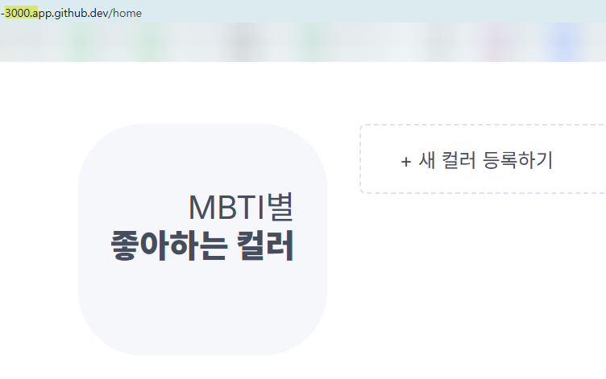
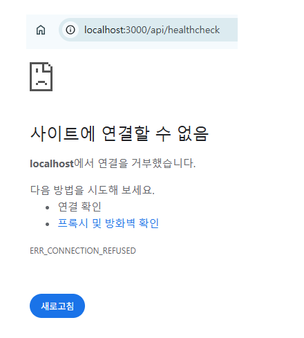

# Ⅰ. 세팅 배경 지식

[Docker Cheat sheet](https://www.canva.com/design/DAGRvX_W5Ug/GmD2peFIJEpvc9mmwo-f8A/view?utm_content=DAGRvX_W5Ug&utm_campaign=designshare&utm_medium=link&utm_source=editor)

## cf. Question 정리

① Hypervisor와 Container 기술의 차이점?
 
> → **Hypervisor**: 하나의 하드웨어 위에 여러 OS 격리실행 </br>
> - **단위**: VM(Virtual Machine)
 
> → **Container**: 하나의 OS 위에 여러 App 격리실행 </br>
> - **단위**: Container
> - **Container build할 내용저장**: Image </br>
>   - **Image**작성방법: 의미있는 단위(layer)들을 조합하여 생성. 변경내용 존재시, 변경이 발생한 layer만 수정하여 조합 </br>
>   - **Image**버전관리방법: Digest (Image version을 지칭, SHA 해시값) </br>
>       - **Digest**관리방법: 중요한 Digest(해시값)에는 tag를 붙여 별칭함 </br>
>       - **tag사용예시**: 가장 최근의 Digest에는 자동으로 "latest" tag가 붙음


</br>

② 일반 Process와 Container의 차이점?

> → **Process**: 메모리 수준에서 격리 </br>

> → **Container**: 네트워크, 파일시스템, 메모리 수준에서 격리 </br>
(기본 Process보다 더 강하게 격리된 Process)

</br>

## 1. Image 관리

### ① 기초정보

[docker image syntax](https://docs.docker.com/reference/cli/docker/image/) </br>
[docker hub](https://hub.docker.com/) # 이미 만들어진 image들 정보 검색

### ② Image pull

```bash
# docker image pull [OPTIONS] NAME[:TAG|@DIGEST]
$ docker image pull node:20.15.1 # tag 이용해서 pull
$ docker image pull node@sha256:b21bcf3e7b6e68d723eabedc6067974950941167b5d7a9e414bd5ac2011cd1c4 # digest 이용해서 pull
$ docker image pull node # 그냥 pull (latest tag가 pull 됨)
```

### ③ Image list

```bash
# docker image ls [OPTIONS] [REPOSITORY[:TAG]]
$ docker image ls
REPOSITORY   TAG       IMAGE ID       CREATED         SIZE
node         latest    ac646c3c87d5   4 days ago      1.13GB
node         <none>    1d063816b8cc   10 months ago   199MB
node         20.15.1   fe6f5eb26002   10 months ago   1.1GB

# diegest를 이용하여 pull하는 경우 tag가 없음(dangling images)
```

### ④ Image remove

```bash
# docker image rm [OPTIONS] IMAGE [IMAGE...]
$ docker image rm node:20.15.1
$ docker image ls
REPOSITORY   TAG       IMAGE ID       CREATED         SIZE
node         latest    ac646c3c87d5   4 days ago      1.13GB
node         <none>    1d063816b8cc   10 months ago   199MB
```

```bash
# docker image prune [OPTIONS]
$ docker image prune -a -f # -a 옵션없으면 모든 dangling images만 삭제함 # -f 옵션 없으면 진짜 삭제할 것인지 한번 더 물어봄
$ docker image ls
REPOSITORY   TAG       IMAGE ID   CREATED   SIZE
```

# Ⅱ. Image Build

## 1. Docker없이 프로덕트 환경 수작업으로 구축해보기기
### ① 의존성 모듈 설치
```bash
# 소스코드 최상위 위치로 이동하여 실행
$ npm ci
```

> "Continuous Integration (CI)" 환경에 최적화된 설치 방식으로서, "package-lock.json"을 기반으로 빠르고 정확하게 패키지를 설치 → "node_module" directory 에 모두 저장됨
> | 항목        | 설명                                        |
> | --------- | ----------------------------------------- |
> | **속도**    | `npm install`보다 **더 빠름**                  |
> | **재현성**   | `package-lock.json`에 **정확히 명시된 버전**으로만 설치 |
> | **설치방법**    | 기존 `node_modules` 폴더를 **완전히 삭제하고 새로 설치**  |

### ② npm run 동작방식 이해

> npm run → "package.json" 파일의 "scripts" 에 정의된 Alias를 실행
> ```json
> // package.json에 정의된 alias
> "scripts": {
>   "dev": "next dev",
>   "build": "next build",
>   "start": "next start",
>   "lint": "next lint"
> }
> ```
> | Alias           | 실제 실행 명령     | 역할 요약                      |
> | --------------- | ------------ | -------------------------- |
> | `npm run dev`   | `next dev`   | 개발 서버 실행 (핫 리로딩 지원)        |
> | `npm run build` | `next build` | 프로덕션용 정적/동적 페이지 빌드         |
> | `npm run start` | `next start` | 빌드 결과를 사용한 프로덕션 서버 실행      |
> | `npm run lint`  | `next lint`  | 코드 스타일 및 문법 검사 (ESLint 사용) |

### ③ npm run build
```bash
$ npm run build  # next build → ".next/" 디렉토리에 빌드 아티팩트 생성함
```

### ④ npm run start
```bash
$ npm run start # next start → next build로 만든 빌드 결과물을 기반으로 서버 실행
> mbti-nextjs@0.1.0 start
> next start

  ▲ Next.js 14.2.3
  - Local:        http://localhost:3000

 ✓ Starting...
 ✓ Ready in 287ms
```
> **localhost:3000 접속시** </br>
> 

## 2. 1번에서 수행한 작업 Dockerfile에 작성하고 Build 해보기 → 산출물: Image

[Dockerfile reference](https://docs.docker.com/reference/dockerfile/)

### ① 전체구조


### ② Dockerfile 작성

최상위폴더/Dockerfile

```Dockerfile
# node를 설치한다.
# FROM 베이스 이미지
ARG NODE_VERSION
FROM node:${NODE_VERSION}

# 소스코드를 다운로드한다.
# COPY [복사할 경로(호스트의 상대경로)] [붙여넣기할 경로(이미지내부의 절대경로)]
COPY . /app

# 소스코드의 최상위 디렉토리로 이동한다.
WORKDIR /app

# 소스코드를 실행할 때 필요한 파일을 다운로드한다. (npm ci)
# 소스코드를 빌드한다 (npm run build)
RUN npm ci \
&& npm run build

# 환경 변수를 정의한다. (PORT)
ENV PORT=3000

# 서버를 실행한다 (npm run start)
ENTRYPOINT ["npm", "run", "start"]
```

### ③ docker buildx build 명령어로 빌드 → 산출물: Image

[docker buildx build syntax](https://docs.docker.com/reference/cli/docker/buildx/build/) </br>

> cf. "docker image build"는 depreciate

```bash
# docker buildx build [OPTIONS] PATH | URL | -
$ docker buildx build \
> -t samon3869/mbti:embedded-db \
> -t samon3869/mbti \
> --build-arg NODE_VERSION=20.15.1 \
> -f ./Dockerfile \
> --pull \
> .
> 
```

```bash
$ docker image ls
REPOSITORY       TAG           IMAGE ID       CREATED         SIZE
samon3869/mbti   embedded-db   069a7d479696   2 minutes ago   1.9GB
samon3869/mbti   latest        069a7d479696   2 minutes ago   1.9GB
```

### ④ 확인용 Question


## 3. docker hub에 Image 배포하기

```bash
$ docker image push samon3869/mbti:embedded-db # embedded-db 배포
$ docker image push samon3869/mbti:latest #latest 배포
$ docker image push -a samon3869/mbti # 모두 배포
```

# Ⅲ. Container run

## 1. Image를 바탕으로 container 실행

[docker container syntax](https://docs.docker.com/reference/cli/docker/container/)

```bash
# docker container run [OPTIONS] IMAGE [COMMAND] [ARG...]
$ docker container run \ 
> --name mbti \ # container 이름 지정
> -e PORT=3000 \ # 환경변수 정의 "--env-file [파일경로]"도 가능
> --rm  \ # 컨테이너가 종료되면 자동으로 컨테이너 관련 정보 삭제 (log 등)
> -d \ # container를 background로 실행 (npm run start이 container를 통해 돌아가고 있어도, container를 background로 실행하기 때문에 터미널을 여전히 사용가능하게 끔 만들어 줌)
> samon3869/mbti:embedded-db
```

```bash
$ docker container ls
CONTAINER ID   IMAGE                        COMMAND           CREATED          STATUS          PORTS     NAMES
97be7c98704e   samon3869/mbti:embedded-db   "npm run start"   25 seconds ago   Up 24 seconds             mbti
```


## 2. container 내부 접속

### ① container 내부 파일 확인

container 내부로 들어가(container exec) 조회하면 됨

```bash
# docker container exec [OPTIONS] CONTAINER COMMAND [ARG...]
# mbti 컨테이너의 최상위 폴더(/app) 안 파일 목록 조회
$ docker container exec mbti ls /app # 컨테이너 내부에서 별도 셸이나 터미널을 띄우지 않고, ls 프로그램을 직접 실행 (linux system call)
Dockerfile
README.md
README_ASSETS
next-env.d.ts
next.config.mjs
node_modules
package-lock.json
package.json
public
src
tsconfig.json
```

### ② container 에서 shell(bash) 접속

```bash
$ docker container exec -it mbti bash
root@97be7c98704e:/app# 
root@97be7c98704e:/app# exit
exit
```

> **-i** : 표준 입력(키보드 입력)을 컨테이너 안의 프로세스로 까지 전달 </br>
> **-t** : 컨테이너 안에 TTY(teletypewriter, pseudo-terminal)를 만들어서, 출력이 깔끔하게 보이게 함 </br>
*(terminal없이 shell(bash)만 실행시키면 출력이 제대로 작동하지 않겠지. Docker는 기본적으로 "비대화형" 환경에서 동작하기 때문에 상용 OS에서 shell을 구동시킬 때와 달리 사용자가 별도로 옵션을 넣어야 줘야하는 것)* </br> </br>
> ☞ **-i**만 쓰면 입력은 되지만 화면 출력이 깨지고, **-t**만 쓰면 입력이 안 되기 때문에 항상 같이 쓰는 게 일반적

### ③ container log 확인

```bash
# docker container logs [OPTIONS] CONTAINER
$ docker container logs -f mbti

> mbti-nextjs@0.1.0 start
> next start

  ▲ Next.js 14.2.3
  - Local:        http://localhost:3000

 ✓ Starting...
 ✓ Ready in 280ms

 # 다른 bash 에서 명령시 (docker container exec mbti > curl localhost:3000/api/healthchec)
| GET | /api/healthchec | Sat May 31 2025 06:28:24 GMT+0000 (Coordinated Universal Time) |
```
✅ 자주 쓰는 옵션

| 옵션         | 설명                                  | 예시                                          |
| ---------- | ----------------------------------- | ------------------------------------------- |
| `-f`       | **follow**, 실시간으로 로그 출력 (tail -f처럼) | `docker logs -f mbti`                       |
| `--tail N` | 마지막 N줄만 출력                          | `docker logs --tail 100 mbti`               |
| `-t`       | 로그에 타임스탬프 포함                        | `docker logs -t mbti`                       |
| `--since`  | 특정 시점 이후의 로그만 출력                    | `docker logs --since="10m" mbti`            |
| `--until`  | 특정 시점까지의 로그만 출력                     | `docker logs --until="2024-12-31T23:59:59"` |

### ④ container 종료

```bash
$ docker container stop mbti
mbti
$ docker container ls -a # --rm 옵션이 있었기 때문에 stop과 동시에 container 삭제됨
CONTAINER ID   IMAGE     COMMAND   CREATED   STATUS    PORTS     NAMES
```
## 3. Container network 접속

### ① container run

```bash
$ docker container run \
> --name mbti \
> -e PORT=3000 \
> --rm \
> -d \
> samon3869/mbti:embedded-db
706c633783326a0138f98a1c2ec57ebc447433b28da5f3e9e20b46b0bc863a40

$ docker container ls
CONTAINER ID   IMAGE                        COMMAND           CREATED         STATUS         PORTS     NAMES
706c63378332   samon3869/mbti:embedded-db   "npm run start"   2 minutes ago   Up 2 minutes             mbti

```

### ② 기존방식으로 접속시(localhost:3000) 문제 확인 
>  </br>
> 네트워크도 격리된 프로세스이기 때문에 컨테이너 바깥에서 통신할 수 없다
</br>

### ③ docker network 을 활용한 network 접속

[docker network syntax](https://docs.docker.com/reference/cli/docker/network/)

```bash
$ docker container stop mbti
mbti
$ docker container ls -a
CONTAINER ID   IMAGE     COMMAND   CREATED   STATUS    PORTS     NAMES
$ docker network create mbti-network
b0406004a8d2ebce4b12bf7e3de54fc7980b27d80281e7c6eacba3674a2c73a2
$ docker network ls
NETWORK ID     NAME           DRIVER    SCOPE
68b41df89b17   bridge         bridge    local
8b6eef7f269a   host           host      local
b0406004a8d2   mbti-network   bridge    local
692c7c594ff3   none           null      local
# 만들지 않은 3개 network (bridge, host, none)은 도커 설치시 기본적으로 제공하는 network임 (driver라고 호칭함)

$ docker container run \
> --name mbti \
> -e PORT=3000 \
> --rm \
> -d \
> --network mbti-network \
> samon3869/mbti:embedded-db
801fc31bee02c1d846a1225607e97c298d814958871430dd3632a67181aaf721

$ docker container inspect mbti

[
    {
      ...  
        "NetworkSettings": {
            "Bridge": "",
            "SandboxID": "42eeda7fcfbd8b4a714ec30ac4d291ce32adceecad3cd6f199c334ba1562887e",
            "SandboxKey": "/var/run/docker/netns/42eeda7fcfbd",
            "Ports": {},
            ...
            "EndpointID": "",
            "Gateway": "",
            "GlobalIPv6Address": "",
            "GlobalIPv6PrefixLen": 0,
            "IPAddress": "",
            ...
            "Networks": {
                "mbti-network": {
                    ...
                    "Gateway": "172.18.0.1",
                    "IPAddress": "172.18.0.2",
                    ...
                    "DNSNames": [
                        "mbti",
                        "801fc31bee02"
                    ]
                }
            }
        }
    }
]
```

다른 컨테이너에서 3000포트 접속 시도도

```bash
$ docker image pull curlimages/curl
$ docker container run \
> --rm \
> curlimages/curl \
> curl mbti:3000/api/healthcheck
  % Total    % Received % Xferd  Average Speed   Time    Time     Time  Current
                                 Dload  Upload   Total   Spent    Left  Speed
  0     0    0     0    0     0      0      0 --:--:-- --:--:-- --:--:--     0curl: (6) Could not resolve host: mbti # 다른 네트워크이기 때문에 접속실패한다

$ docker container run \
> --rm \
> --network mbti-network \
> curlimages/curl \
> curl mbti:3000/api/healthcheck
  % Total    % Received % Xferd  Average Speed   Time    Time     Time  Current
                                 Dload  Upload   Total   Spent    Left  Speed
100    15    0    15    0     0    122      0 --:--:-- --:--:-- --:--:--   122 # 접속에 성공한다

$ docker container run \
> --rm \
> curlimages/curl \
> curl 172.18.0.2:3000/api/healthcheck
  % Total    % Received % Xferd  Average Speed   Time    Time     Time  Current
                                 Dload  Upload   Total   Spent    Left  Speed
100    15    0    15    0     0   1737      0 --:--:-- --:--:-- --:--:--  1875 # 접속에 성공한다
```
```bash
$ docker container stop mbti
mbti

$ docker container run \
> --name mbti \
> -e PORT=3000 \
> --rm \
> -d \
> samon3869/mbti:embedded-db
f2c6ffc3749dc1ad5f3f37f79fb049d7afb75c968767461f4ce358aa747b606f

$ docker container inspect mbti
[
    {
      ...
        "NetworkSettings": {
            "Bridge": "",
            "SandboxID": "fcdcbd9e898cf127b4e8055ebfafa33821aa19a2cb9ae3f4666688c8b356f623",
            "SandboxKey": "/var/run/docker/netns/fcdcbd9e898c",
            "Ports": {},
            ...
            "Gateway": "172.17.0.1",
            "GlobalIPv6Address": "",
            "GlobalIPv6PrefixLen": 0,
            "IPAddress": "172.17.0.2",
            ...
            "Networks": {
                "bridge": {
                    ...
                    "Gateway": "172.17.0.1",
                    "IPAddress": "172.17.0.2",
                    ...
                    "DNSNames": null
                }
            }
        }
    }
] # DNSNames 이 없고, IPaddress만 있음. IPaddress는 매번 바뀔 수 있기 때문에 기본 network보다는 커스텀 network 설정해서 접속하기
```

```bash
$ docker container run \
> --name mbti \
> -e PORT=3000 \
> --rm \
> -d \
> -p 4000:3000 \
> samon3869/mbti:embedded-db
4f15d7055ccd42c674bcf17ba3bbc1201bdc5dee53758ff5c033c856d05f279d

$ docker container ls
CONTAINER ID   IMAGE                        COMMAND           CREATED          STATUS          PORTS                                         NAMES
4f15d7055ccd   samon3869/mbti:embedded-db   "npm run start"   18 seconds ago   Up 17 seconds   0.0.0.0:4000->3000/tcp, [::]:4000->3000/tcp   mbti
```

```bash
$ docker container inspect mbti
[
    {
      ...
        "NetworkSettings": {
            "Bridge": "",
            ...
            "Ports": {
                "3000/tcp": [
                    {
                        "HostIp": "0.0.0.0",
                        "HostPort": "4000"
                    },
                    {
                        "HostIp": "::",
                        "HostPort": "4000"
                    }
                ]
            },
            ...
            "Gateway": "172.17.0.1",
            "GlobalIPv6Address": "",
            "GlobalIPv6PrefixLen": 0,
            "IPAddress": "172.17.0.2",
            ...
            "Networks": {
                "bridge": {
                    "IPAMConfig": null,
                    ...
                    "Gateway": "172.17.0.1",
                    "IPAddress": "172.17.0.2",
                    ...
                    "DNSNames": null
                }
            }
        }
    }
]
```



```bash
$ docker run \
> --rm \
> --network other-network \
> --add-host=host.docker.internal:host-gateway \
> curlimages/curl \
> curl http://host.docker.internal:4000/api/healthcheck
  % Total    % Received % Xferd  Average Speed   Time    Time     Time  Current
                                 Dload  Upload   Total   Spent    Left  Speed
100    15    0    15    0     0   1664      0 --:--:-- --:--:-- --:--:--  1875
```

> host-gateway는 Docker가 호스트 머신의 IP 주소를 자동으로 넣어주는 예약어입니다.
>이 덕분에 컨테이너 안에서도 host.docker.internal이라는 도메인으로 로컬 호스트(호스트 머신)에 접근 가능해집니다.
>📌 이건 Docker 20.10+ 버전에서만 동작합니다.


```bash
$ docker container run \
> --name mbti \
> -e PORT=3000 \
> --rm \
> -d \
> --expose 3000 \
> samon3869/mbti:embedded-db
48271020be0e18e98fa3c7549283c67a678ac7e8c04f2e1174a36f5e7ebde045

$ docker container inspect mbti
[
    {
      ...
        "Config": {
            "Hostname": "48271020be0e",
            "Domainname": "",
            "User": "",
            "AttachStdin": false,
            "AttachStdout": false,
            "AttachStderr": false,
            "ExposedPorts": {
                "3000/tcp": {}
            },
          ...
        },
    }
    
]
```




## 4. Container volume 활용

[docker volume syntax](https://docs.docker.com/reference/cli/docker/volume/)

```bash
$ docker volume create my-first-volume
my-first-volume
$ docker volume ls
DRIVER    VOLUME NAME
local     my-first-volume
$ docker volume rm my-first-volume
my-first-volume
$ docker volume ls
DRIVER    VOLUME NAME
```

```bash
$ docker image pull busybox
$ docker volume create busybox-volume
busybox-volume
$ docker volume ls
DRIVER    VOLUME NAME
local     busybox-volume
$ docker container run \
> --name busybox \
> --rm \
> -v busybox-volume:/data \
> -it \
> busybox \
> sh
/ # cd /data/
/data # touch busy.dat box.log
/data # ls
box.log   busy.dat
/data # exit
```


```bash
$ docker container run \
> --name other-busybox \
> --rm \
> -v busybox-volume:/other-data \
> -it \
> busybox \
> sh
/ # cd /other-data/
/other-data # ls
box.log   busy.dat
/other-data # exit
```

```bash
$ docker container ls
CONTAINER ID   IMAGE     COMMAND   CREATED   STATUS    PORTS     NAMES
$ docker container run \
> --name busybox \
> --rm \
> -v busybox-volume:/data \
> -it \
> busybox \
> sh
/ # cd /data/
/data # ls
box.log   busy.dat
/data #
/data #
/data #
/data #
```

```bash
$ docker container inspect busybox
[
    {
      ...
        "Mounts": [
            {
                "Type": "volume",
                "Name": "busybox-volume",
                "Source": "/var/lib/docker/volumes/busybox-volume/_data",
                "Destination": "/data",
                "Driver": "local",
                "Mode": "z",
                "RW": true,
                "Propagation": ""
            }
        ],
        ...
    }
]
```

```bash
$ docker container run \
> --name busybox-anonymous \
> --rm \
> -it \
> -v /data \
> busybox \
> sh
/ # 
/ # 
/ # 
/ # 
/ # 
```

```bash
$ docker container inspect busybox-anonymous
[
    {
      ...
        "Mounts": [
            {
                "Type": "volume",
                "Name": "d1cb275aca80079b1fe4fc406b6742069f305d9c17c5dbb47d27d5f6293723eb",
                "Source": "/var/lib/docker/volumes/d1cb275aca80079b1fe4fc406b6742069f305d9c17c5dbb47d27d5f6293723eb/_data",
                "Destination": "/data",
                "Driver": "local",
                "Mode": "",
                "RW": true,
                "Propagation": ""
            }
        ],
    }
]
```


```bash
$ docker container run \
> --rm \
> -it \
> -v /workspaces/codeit_docker/host-volume:/data \
> busybox \
> sh
/ # cd /data/
/data # touch busy.dat
/data # touch box.log
/data # 

```

